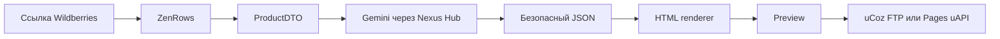

# UcozSwapper

> Карточка Wildberries в самостоятельный AI-лендинг на uCoz за несколько шагов.

[](https://react.dev/)
[](https://vite.dev/)
[](https://nodejs.org/)
[](LICENSE)

UcozSwapper получает публичную ссылку на товар Wildberries, собирает данные карточки через ZenRows, формирует продающую структуру с помощью Gemini и публикует готовую standalone-страницу на uCoz.

## Возможности

- сбор названия, публичной цены, артикула, описания, характеристик и фотографий товара;
- проверка и нормализация данных в единый `ProductDTO`;
- понятные ошибки вместо публикации неполной карточки;
- AI-генерация заголовков, преимуществ, характеристик, FAQ и CTA;
- случайный выбор проверенного шаблона и варианта слайдера;
- светлые и тёмные варианты готовых лендингов;
- preview карточки и будущего лендинга до публикации;
- demo-публикация через настроенный backend и `ucoz-mcp`/FTP;
- публикация на сайт пользователя через одноразовый uAPI key;
- локальная история успешных операций в браузере;
- адаптивный светлый/тёмный интерфейс.

## Как это работает



Модель не возвращает произвольный исполняемый HTML. Она генерирует структурированный JSON, после чего backend валидирует его и собирает страницу собственным renderer. Это делает результат предсказуемее и безопаснее.

## Стек

### Frontend

- React 19;
- Vite 7;
- Preline UI и Tailwind CSS 4;
- Lucide React;
- Montserrat и Ubuntu;
- browser `localStorage` для истории операций.

### Backend

- Node.js;
- Fastify 5;
- Zod;
- Cheerio;
- native Fetch API;
- MCP SDK и `ucoz-mcp`.

### Интеграции

- ZenRows — получение отрендеренной карточки Wildberries;
- Nexus Hub — LLM gateway;
- Gemini 3.8 Flash — генерация структуры лендинга;
- uCoz FTP — demo-публикация standalone HTML;
- uCoz Pages uAPI — публикация на пользовательский сайт.

## Требования

- Git 2.x;
- Node.js `^20.19.0` или `>=22.12.0`;
- npm из комплекта Node.js;
- ZenRows API key для реального парсинга;
- Nexus Hub API key для реальной AI-генерации;
- uCoz-сайт и соответствующие credentials для публикации.

Глобально устанавливать Vite, Fastify или `ucoz-mcp` не нужно.

## Быстрый запуск

Команды ниже выполняются из корня проекта в Windows Command Prompt.

```cmd
git clone https://github.com/capibara2004/ucozswapper.git
cd ucozswapper
npm ci
npm --prefix client ci
npm --prefix server ci
copy server\.env.example server\.env
npm run dev
```

После запуска:

- frontend: `http://localhost:5173`;
- backend: `http://127.0.0.1:3001`;
- health check: `http://127.0.0.1:3001/api/health`.

Vite автоматически проксирует запросы `/api/*` на backend.

## Настройка окружения

Все секреты указываются только в `server\.env`. Этот файл исключён из Git.

Минимальная конфигурация для парсинга и AI:

```dotenv
PORT=3001
NODE_ENV=development
DEMO_FALLBACK=false

ZENROWS_API_KEY=your_zenrows_key
ZENROWS_CAPTURE_XHR=false
ZENROWS_EMPTY_RETRY=true

NEXUS_API_KEY=your_nexus_key
NEXUS_API_BASE_URL=https://api.nexus-hub.tech/v1
NEXUS_MODEL=gemini-3.8-flash
AI_DEMO_FALLBACK=false
```

Для demo-публикации через FTP:

```dotenv
UCOZ_SITE_URL=https://your-site.ucoz.net
UCOZ_PUBLISH_MODE=ftp
UCOZ_FTP_HOST=your-ftp-host
UCOZ_FTP_USER=your-ftp-user
UCOZ_FTP_PASS=your-ftp-password
```

Для публикации через Pages API из backend-конфигурации:

```dotenv
UCOZ_SITE_URL=https://your-site.ucoz.net
UCOZ_PUBLISH_MODE=pages
UCOZ_API_TOKEN=your_uapi_key
```

Не помещайте ключи в frontend-код, issue, commit или скриншоты.

## Публикация на пользовательский uCoz

Пользователь может выбрать отдельную публикацию через uAPI и передать:

1. HTTPS-адрес своего uCoz-сайта;
2. uAPI key с минимально необходимыми правами на Pages;
3. подготовленный лендинг из текущего preview.

Ключ передаётся backend один раз для конкретной операции и не сохраняется в `localStorage`. На сайте должен быть включён модуль Pages. Для собственного URL страницы также необходимо разрешить индивидуальные URL в SEO-настройках uCoz.

## API

| Метод | Endpoint | Назначение |
|---|---|---|
| `GET` | `/api/health` | Состояние backend и интеграций |
| `POST` | `/api/parse` | Ссылка WB → валидированный `ProductDTO` |
| `POST` | `/api/generate` | `ProductDTO` → AI-контент, дизайн и HTML |
| `POST` | `/api/publish` | Публикация на demo-сайт из `.env` |
| `POST` | `/api/publish/uapi` | Публикация на сайт пользователя через uAPI |

## Production-сборка

```cmd
npm run build
npm start
```

`npm run build` создаёт frontend-сборку в `client\dist`. Команда `npm start` запускает Fastify, который обслуживает API и production frontend.

## Проверки

```cmd
npm run build
npm --prefix server run smoke:generate
npm --prefix server run smoke:uapi-fallback
```

`smoke:generate` выполняет реальный запрос к LLM и расходует квоту провайдера.

## Структура проекта

```text
client/
  src/
    components/          React-компоненты preview, истории и публикации
server/
  src/
    handlers/
      llmhandler.js      Nexus Hub, schema и выбор дизайна
      landingrenderer.js Безопасный HTML renderer
      ucozpublisher.js   FTP и Pages uAPI
    index.js             Fastify API и ProductDTO pipeline
planning.md              Текущий план и backlog
sammary.md               Краткий контекст для передачи другому агенту
technical.md              Расширенная инструкция локального запуска
```

## Ограничения MVP

- сейчас поддерживаются публичные карточки Wildberries;
- цена получается без авторизации WB и отображается как публичная цена без WB Кошелька;
- изменение разметки или anti-bot-защиты маркетплейса может потребовать обновления parser;
- изображения пока могут загружаться с внешнего CDN Wildberries;
- production endpoint с пользовательским uAPI необходимо защищать HTTPS, rate limit и redaction логов;
- перед production deployment все ранее использованные тестовые ключи следует ротировать.

Используйте проект с соблюдением условий маркетплейса, ZenRows, Nexus Hub и uCoz.

## Документация проекта

- [План и текущий статус](planning.md)
- [Краткое описание](sammary.md)
- [Технический запуск](technical.md)

## Лицензия

Проект распространяется по лицензии [Apache License 2.0](LICENSE).
